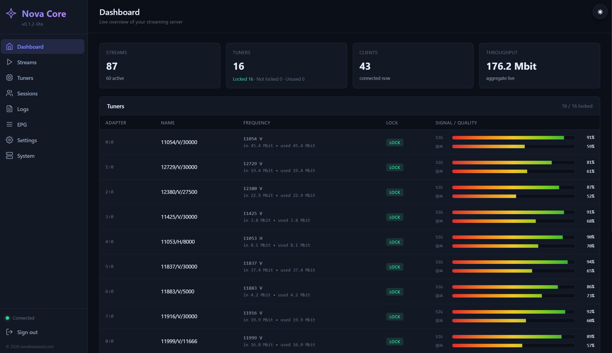

<div align="center">

# Nova Core

**DVB → IP streaming headend. One static binary. No ffmpeg, no dependencies.**

Turn DVB-S / S2 / T / T2 / C tuners into HTTP-TS, HLS and UDP streams with a modern web UI, EPG, and a built-in playlist — on a single Linux binary you install in one command.

[](https://github.com/novaheadend/nova-core-releases/releases/latest)


</div>

> A lightweight, self-hosted **IPTV streaming server** and **DVB-to-IP gateway** — a free, modern alternative to Astra (Cesbo) and Flussonic for satellite / terrestrial / cable headends.

<!-- TODO: drop a UI screenshot / GIF here — it sells the product -->
<!--  -->

## Features

- **Inputs:** DVB-S, DVB-S2, DVB-T, DVB-T2, DVB-C (full Linux DVB API, v5 signal stats)
- **Outputs:** HTTP-TS, HLS, UDP / multicast, and a one-click `/playlist.m3u`
- **Modern web UI** — tuners, streams, live signal / quality, client sessions, logs, EPG
- **EPG** — XMLTV harvest and serve, per-source scheduling
- **Single static binary** — no ffmpeg, no Python, nothing else to install
- **One-command install** — systemd unit + bootstrap admin, done
- **Light on resources** — runs a 60+ stream headend on a low-power APU
- **Secure by default** — IP allow-list and brute-force-resistant admin login
- **Architectures** — Linux amd64, arm64, armv7

## Quick start

```sh
# Download the build for your CPU from Releases, verify, then:
tar -xzf nova-core-linux-amd64.tar.gz
sudo ./nova-core -install
# Open the URL it prints and log in with the generated admin password.
```

Uninstall any time with `sudo ./nova-core -uninstall`.

## How it compares

| | **Nova Core** | Astra (Cesbo) | Flussonic |
|---|---|---|---|
| Price | **Free core** | Commercial | Commercial ($$$) |
| Footprint | **Single binary, no deps** | Binary + Lua | Heavy install |
| DVB-S / S2 / T / T2 / C input | ✅ | ✅ | ✅ |
| HTTP-TS / HLS / UDP output | ✅ | ✅ | ✅ |
| Built-in modern web UI | ✅ | partial | ✅ |
| EPG (XMLTV) | ✅ | ✅ | ✅ |
| ARM / low-power | ✅ | partial | ❌ |

## Documentation

Full docs and the project site: **[novaheadend.com](https://novaheadend.com)**

## License

Nova Core is **proprietary software, free to use** in binary form — see [LICENSE](LICENSE). The source is not public. An **Enterprise** edition with extended integrations is available; get in touch via [novaheadend.com](https://novaheadend.com).

---

<div align="center">
<sub>Nova Core — DVB to MPEG-TS streaming headend · self-hosted IPTV server · Astra / Flussonic alternative · © novaheadend.com</sub>
</div>
