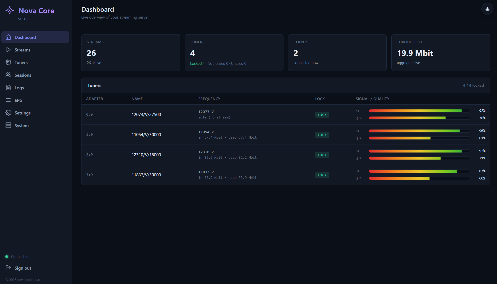

<div align="center">

# Nova Core

**A dependency-free DVB → MPEG-TS streaming headend — multi-core, self-healing, built to run 24/7.**

Tune satellite, terrestrial, and cable muxes and restream them over IP —
one static binary, no ffmpeg, no libraries.

[](https://github.com/novaheadend/nova-core-releases/releases/latest)




</div>

---

## What it does

Nova Core turns a Linux box with DVB tuners into a live IPTV headend:

- **DVB-S/S2, DVB-T/T2, DVB-C** tuning
- **Native Go MPEG-TS** demux + single-program PAT/PMT rewrite — **no ffmpeg, no transcode, no re-mux artifacts**
- **Frame-accurate A/V sync** — PCR and PTS/DTS preserved end-to-end, so audio and video stay locked with zero lip-sync drift, even on streams running for weeks
- **HTTP-TS** and **UDP / RTP multicast** egress, with per-output interface binding
- **EPG / XMLTV** harvesting (SDT + EIT)
- **M3U playlist** of every channel — paste straight into VLC or a set-top box
- Live **web dashboard**: streams, tuners, connected clients, logs, real-time signal / quality
- **Security**: IP allow-list, login captcha after repeated failures, API brute-force lockout
- **Operations**: scheduled restarts, idle-tuner signal monitoring, one-click log export, in-UI config editor

## Built to run 24/7

Nova Core is engineered to stream unattended for months at a time:

- **Multi-core by design** — every channel runs concurrently on its own worker. Throughput scales with your CPU cores, not a single thread. Dozens of streams on one box, no sweat.
- **Self-healing** — if a feed drops (rain fade, signal loss, an upstream hiccup), Nova detects it and **automatically re-tunes and restores the stream**. No operator, no manual restart.
- **Rock-solid stability** — battle-tested on a live 26-channel headend running continuously. Bounded, GC-tuned memory keeps RAM flat even under heavy multi-stream load.
- **Crash- and reboot-proof** — runs as a `systemd` service with automatic restart; after a power cut or kernel update it comes back streaming on its own.
- **Scheduled restarts** — optional daily/weekly maintenance windows keep long-running deployments fresh.

One static binary. Zero runtime dependencies. Set it up once and forget it's there.

## Quick start

```bash
# 1. Pick your CPU architecture and download the latest release
#    amd64 = PC / x86-64 server   arm64 = Pi 4/5 + ARM servers   armv7 = older 32-bit Pi
ARCH=amd64
BASE=https://github.com/novaheadend/nova-core-releases/releases/latest/download
curl -LO $BASE/nova-core-linux-$ARCH.tar.gz
curl -LO $BASE/nova-core-linux-$ARCH.tar.gz.sha256

# 2. Verify, then extract (always unpacks to a fixed )
sha256sum -c nova-core-linux-$ARCH.tar.gz.sha256
tar xzf nova-core-linux-$ARCH.tar.gz

# 3. Install as a systemd service
sudo ./nova-core -install
```

The installer creates `/opt/nova-core`, registers a `systemd` service, and prints your dashboard URL plus a generated admin password:

```
  Nova Core installed
  URL    http://<your-ip>:<port>
  user   admin
  pass   3f9a…c8
```

Open the URL, sign in, change the password from **Settings → Users**, then add your tuners and channels.

## Requirements

| | |
|---|---|
| OS | Linux **x86-64**, **ARM64**, or **ARMv7** |
| Tuners | DVB kernel drivers for your card (TBS and similar) |
| Privileges | root (for `/dev/dvb` access) |
| Dependencies | **none** — no ffmpeg, no libraries |

## Updating

```bash
# Re-run the installer with a newer binary — your config is preserved.
sudo ./nova-core -install
```

## Uninstall

```bash
# Removes the service and binary. Keeps nova.json + users.json.
sudo /opt/nova-core/nova-core -uninstall
```

## Verifying integrity

Every release ships a matching `nova-core-linux-<arch>.tar.gz.sha256`. Always verify before installing:

```bash
sha256sum -c nova-core-linux-amd64.tar.gz.sha256
```

## License

Nova Core is **proprietary freeware** — free to use, closed-source. Only the
compiled binary is distributed here; the source is not public.

---

<div align="center">

© 2026 [novaheadend.com](https://novaheadend.com)

</div>
